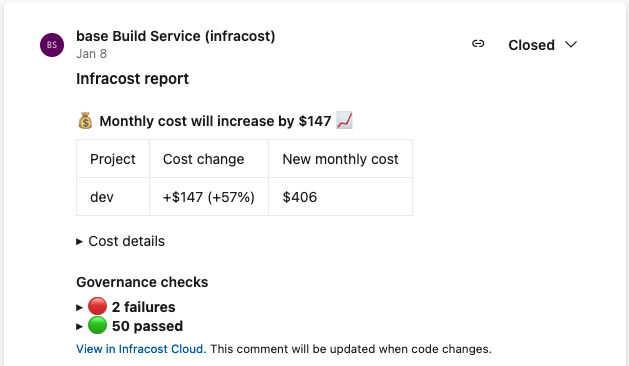

# Infracost Azure Pipelines integration

This project provides Azure Pipeline tasks for Infracost along with examples of how you can use it to to see cloud cost estimates for Terraform in pull requests 💰



## Quick start

The Azure Pipelines Infracost tasks can be used with either Azure Repos (only git is supported) or GitHub repos. The following steps assume a simple Terraform directory is being used, we recommend you use a more relevant [example](#examples) if required.

1. In the Azure DevOps Marketplace, Add the [Terraform installer task](https://marketplace.visualstudio.com/items?itemName=ms-devlabs.custom-terraform-tasks) to your organization by clicking 'Get it free', selecting your organization and clicking Install. If you do not have permission to install the task, you can submit a request to your organization's admin who will get emailed the details of the request.

2. Repeat step 1 for the [Infracost tasks](TODO: add link).

3. Retrieve your Infracost API key by running `infracost configure get api_key`. If you don't have one, [download Infracost](https://www.infracost.io/docs/#quick-start) and run `infracost register` to get a free API key.

4. If you are using an Azure Repos repositories follow the [Azure Repos quick start](#azure-repos-quick-start). Currently this only supports Git repositories.

5. If you are using a GitHub repository follow the [GitHub Repos quick start](#github-repos-quick-start)

## Azure Repos Quick start

1. Enable pull request build triggers. Without this, Azure Pipelines do not trigger builds with the pull request ID, thus comments cannot be posted by the integration.

    a. From your Azure DevOps organization, click on your project > Project Settings > Repositories > your repository

    b. Select the Policies tab and under the Branch Policies select on your default branch (master or main)

    c. Scroll to Build Validation and click + sign to add one if you don't have one already

    d. Select your 'Build pipeline', leave 'Path filter' blank, set 'Trigger' to Automatic, and 'Policy requirement' to Optional (you can also use Required but we don't recommend it).

2. Enable Azure Pipelines to post pull request comments

    a. From your Azure DevOps organization, click on your project > Project Settings > Repositories > your repository

    b. Click on the Securities tab, scroll down to Users and click on the '[project name] Build Service ([org name])' user, and set the 'Contribute to pull requests' to Allow.

3. Add secret variables: from your Azure DevOps organization, click on your project > Pipelines > your pipeline > Edit > Variables, and click the + sign to add variables for the following. Also tick the 'Keep this value secret' option.

    - `infracostApiKey`: with your Infracost API key as the value, and select 'Keep this value secret'.
    - Any cloud provider credentials you need for running `terraform init` and `terraform plan`:
      - **Terraform Cloud/Enterprise users**: the [Terraform docs](https://www.terraform.io/cli/config/config-file#credentials-1) explain how to configure credentials for this using a config file, or you can pass the credentials as environment variables directly to Infracost as in [this example](examples/terraform-cloud-enterprise).
      - **AWS users**: the [Terraform docs](https://registry.terraform.io/providers/hashicorp/aws/latest/docs#environment-variables) explain the environment variables to set for this.
      - **Azure users**: the [Terraform docs](https://registry.terraform.io/providers/hashicorp/azurerm/latest/docs/guides/service_principal_client_secret) explain the options.
      - **Google users**: the [Terraform docs](https://registry.terraform.io/providers/hashicorp/google/latest/docs/guides/provider_reference#full-reference) explain the options, e.g. using `GOOGLE_CREDENTIALS`.

4.  Add the following to the `azure-pipelines.yml` file:

    ```yaml
    # The Azure Pipelines docs (https://docs.microsoft.com/en-us/azure/devops/pipelines/process/tasks) describe other options.
    # Running on pull requests to `master` (or your default branch) is a good default.
    pr:
      - master

    variables:
      TF_ROOT: PATH/TO/TERRAFORM/CODE # Update this!

    jobs:
      - job: infracost
        displayName: Run Infracost
        pool:
          vmImage: ubuntu-latest

        steps:
            # Typically the Infracost actions will be used in conjunction with the Terraform tool installer task.
            # If this task is not available you can add it to your org from https://marketplace.visualstudio.com/items?itemName=ms-devlabs.custom-terraform-tasks.
            # Subsequent steps can run Terraform commands as bash tasks. Alternatively, the Terraform tasks
            # can be used, but we recommend bash tasks since they are simpler.
          - task: TerraformInstaller@0
            displayName: Install Terraform

          # IMPORTANT: add any required steps here to setup cloud credentials so Terraform can run

          - bash: terraform init
            displayName: Terraform init
            workingDirectory: $(TF_ROOT)

          - bash: terraform plan -out tfplan.binary
            displayName: Terraform plan
            workingDirectory: $(TF_ROOT)

          - bash: terraform show -json tfplan.binary > plan.json
            displayName: Terraform show
            workingDirectory: $(TF_ROOT)

          # Install the Infracost CLI, see https://github.com/infracost/actions/tree/master/overview.md#infracostsetup-task
          # for other inputs such as version, and pricingApiEndpoint (for self-hosted users).
          - task: InfracostSetup@0
            displayName: Setup Infracost
            inputs:
              apiKey: $(infracostApiKey)

          # Run Infracost and generate the JSON output, the following docs might be useful:
          # Multi-project/workspaces: https://www.infracost.io/docs/features/config_file
          # Combine Infracost JSON files: https://www.infracost.io/docs/features/cli_commands/#combined-output-formats
          - bash: infracost breakdown --path=$(TF_ROOT)/plan.json --format=json --out-file=/tmp/infracost.json
            displayName: Run Infracost

          # See https://github.com/infracost/actions/tree/master/overview.md#infracostcomment-task for other options
          - task: InfracostComment@0
            displayName: Post Infracost comment
            inputs:
              azureReposToken: $(System.AccessToken) # Do not change this, it's used to post comments
              path: /tmp/infracost.json
              # Choose the commenting behavior, 'update' is a good default:
              behavior: update # Create a single comment and update it. The "quietest" option.
              # behavior: delete-and-new # Delete previous comments and create a new one.
              # behavior: hide-and-new # Minimize previous comments and create a new one.
              # behavior: new # Create a new cost estimate comment on every push.
    ```

5. Click 'Save and run'

6. 🎉 That's it! Send a new pull request to change something in Terraform that costs money. You should see a pull request comment that gets updated, e.g. the 📉 and 📈 emojis will update as changes are pushed!

    If there are issues, you can enable the 'Enable system diagnostics' check box when running the pipeline manually or for more options see [this page](https://docs.microsoft.com/en-us/azure/devops/pipelines/troubleshooting/review-logs).

## GitHub Repos Quick Start

1. Create a GitHub token (such as Personal Access Token) that can be used by the pipeline to post comments. The token needs to have `repo` scope so it can post comments.

2. Add secret variables: from your Azure DevOps organization, click on your project > Pipelines > your pipeline > Edit > Variables, and click the + sign to add variables for the following":

    - `infracostApiKey`: with your Infracost API key as the value, and select 'Keep this value secret'.
    - `githubToken` with your GitHub access token as the value, and select 'Keep this value secret'.
    - Any cloud provider credentials you need for running `terraform init` and `terraform plan`:
      - **Terraform Cloud/Enterprise users**: the [Terraform docs](https://www.terraform.io/cli/config/config-file#credentials-1) explain how to configure credentials for this using a config file, or you can pass the credentials as environment variables directly to Infracost as in [this example](examples/terraform-cloud-enterprise).
      - **AWS users**: the [Terraform docs](https://registry.terraform.io/providers/hashicorp/aws/latest/docs#environment-variables) explain the environment variables to set for this.
      - **Azure users**: the [Terraform docs](https://registry.terraform.io/providers/hashicorp/azurerm/latest/docs/guides/service_principal_client_secret) explain the options.
      - **Google users**: the [Terraform docs](https://registry.terraform.io/providers/hashicorp/google/latest/docs/guides/provider_reference#full-reference) explain the options, e.g. using `GOOGLE_CREDENTIALS`.

3.  Add the following to the `azure-pipelines.yml` file:

    ```yaml
    # The Azure Pipelines docs (https://docs.microsoft.com/en-us/azure/devops/pipelines/process/tasks) describe other options.
    # Running on pull requests to `master` (or your default branch) is a good default.
    pr:
      - master

    variables:
      TF_ROOT: PATH/TO/TERRAFORM/CODE # Update this!

    jobs:
      - job: infracost
        displayName: Run Infracost
        pool:
          vmImage: ubuntu-latest

        steps:
            # Typically the Infracost actions will be used in conjunction with the Terraform tool installer task
            # If this task is not available you can add it to your org from https://marketplace.visualstudio.com/items?itemName=ms-devlabs.custom-terraform-tasks.
            # Subsequent steps can run Terraform commands as they would in the shell.
          - task: TerraformInstaller@0
            displayName: Install Terraform

          # IMPORTANT: add any required steps here to setup cloud credentials so Terraform can run

          - bash: terraform init
            displayName: Terraform init
            workingDirectory: $(TF_ROOT)

          - bash: terraform plan -out tfplan.binary
            displayName: Terraform plan
            workingDirectory: $(TF_ROOT)

          - bash: terraform show -json tfplan.binary > plan.json
            displayName: Terraform show
            workingDirectory: $(TF_ROOT)

          # Install the Infracost CLI, see https://github.com/infracost/actions/tree/master/tasks/setup/overview.md
          # for other inputs such as version, and pricingApiEndpoint (for self-hosted users).
          - task: InfracostSetup@0
            displayName: Setup Infracost
            inputs:
              apiKey: $(infracostApiKey)

          # Run Infracost and generate the JSON output, the following docs might be useful:
          # Multi-project/workspaces: https://www.infracost.io/docs/features/config_file
          # Combine Infracost JSON files: https://www.infracost.io/docs/features/cli_commands/#combined-output-formats
          - bash: infracost breakdown --path=$(TF_ROOT)/plan.json --format=json --out-file=/tmp/infracost.json
            displayName: Run Infracost

          # See https://github.com/infracost/infracost-azure-devops/tree/master/tasks/comment/overview.md for other options
          - task: InfracostComment@0
            displayName: Post Infracost comment
            inputs:
              githubToken: $(githubToken) # Required to post comments
              path: /tmp/infracost.json
              # Choose the commenting behavior, 'update' is a good default:
              behavior: update # Create a single comment and update it. The "quietest" option.
              # behavior: delete-and-new # Delete previous comments and create a new one.
              # behavior: hide-and-new # Minimize previous comments and create a new one.
              # behavior: new # Create a new cost estimate comment on every push.
              # Limit the object that should be commented on, either merge-request or commit
              # targetType: pull-request
    ```

4. Click 'Save and run'

5. 🎉 That's it! Send a new pull request to change something in Terraform that costs money. You should see a pull request comment that gets updated, e.g. the 📉 and 📈 emojis will update as changes are pushed!

    If there are issues, you can enable the 'Enable system diagnostics' check box when running the pipeline manually or for more options see [this page](https://docs.microsoft.com/en-us/azure/devops/pipelines/troubleshooting/review-logs).

## Examples

The [examples](examples) directory demonstrates how these actions can be used in different workflows, including:
  - [Terraform directory](examples/terraform-directory): a Terraform directory containing HCL code
  - [Terraform plan JSON](examples/terraform-plan-json): a Terraform plan JSON file
  - [Terragrunt](examples/terragrunt): a Terragrunt project
  - [Terraform Cloud/Enterprise](examples/terraform-cloud-enterprise): a Terraform project using Terraform Cloud/Enterprise
  - [Multi-project using config file](examples/multi-project/README.md#using-an-infracost-config-file): multiple Terraform projects using the Infracost [config file](https://www.infracost.io/docs/multi_project/config_file)
  - [Multi-project using build matrix](examples/multi-project/README.md#using-azure-devops-pipeline-matrix-strategy): multiple Terraform projects using the Azure pipelines matrix strategy
  - [Multi-Terraform workspace](examples/multi-terraform-workspace): multiple Terraform workspaces using the Infracost [config file](https://www.infracost.io/docs/multi_project/config_file)
  - [Private Terraform module](examples/private-terraform-module/README.md): a Terraform project using a private Terraform module
  - [Slack](examples/slack): send cost estimates to Slack

Cost policy examples:
- [Thresholds](examples/thresholds): only post a comment when cost thresholds are exceeded
- [Conftest](examples/conftest): check Infracost cost estimates against policies using Conftest
- [OPA](examples/opa): check Infracost cost estimates against policies using Open Policy Agent
- [Sentinel](examples/sentinel): check Infracost cost estimates against policies using HashiCorp's Sentinel

## Tasks

* We recommend you use the above quick start guide and examples, which combine the following individual actions:

- [InfracostSetup](overview.md#infracostsetup-task): installs and configures Infracost CLI.
- [InfracostComment](overview.md#infracostcomment-task): adds comments to GitHub pull requests and commits, or Azure Repos pull requests.

## Contributing

Issues and pull requests are welcome! For development details, see the [contributing](CONTRIBUTING.md) guide. For major changes, including interface changes, please open an issue first to discuss what you would like to change. [Join our community Slack channel](https://www.infracost.io/community-chat), we are a friendly bunch and happy to help you get started :)

## License

[Apache License 2.0](https://choosealicense.com/licenses/apache-2.0/)
